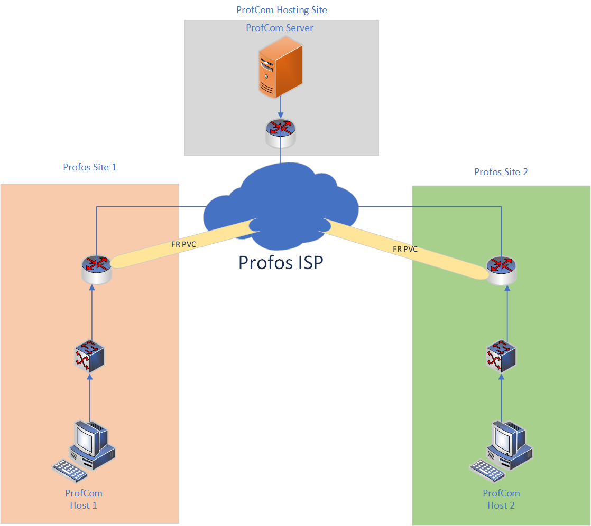

# Reverse Engineering and Network Traffic Analysis

## Walk Through on Analysis of ProfCom

## Questions

* Integer = 8 bytes
* Boolean = 1 byte

ProfCom is a communication protocol used to relay important messages back to a central command. According to our intel ProfCom Servers operate on port 8080 to try and mask the identity of the application. We planted spyware on a ProfCom users computer and retreived an important asset that should be useful to us. We were able to retreive the ProfComClient application off of their computer. We have a basic understanding of how this protocol works, that information is what follows these instructions.

Client -> Server

	Login Process:

		Integer Length of Username
		Char Username
		Integer Length of Password
		Char Password

Server -> Client

	Login Process:

		Boolean Password Accept/Rejected 

If authentication fails login process is reinitiated by the client.

Client -> Server

	Data Exchange:

		Integer Number of Messages to Send
		Integer Length of Message
		Char Data

After this message the client and server will disconnect

### Question 1:

	What are the usernames of the users who successfully log in?

### Question 2:
	
	What is the key used to encrypt the passwords and messages?

### Question 3:

	What password is used to successfully authenticate the 2nd user?

### Question 4:

	What IP address did the 1st user successfully authenticate from?

### Question 5:

	What is the IP address of the server?

### Question 6:

	How many messages were sent by the 2nd user that successfully authenticated?

### Question 7:

	What is the flag that was transfered by the protocol?

### Question 8:
	
	Where was this capture completed based on the diagram?

	
